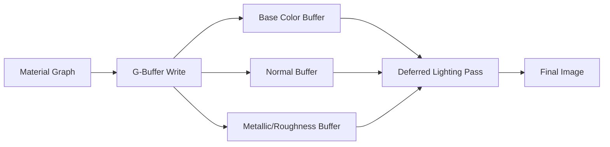

# Introduction to the Material Editing Environment

The Unreal Engine 5 (UE5) Material Editor represents a sophisticated integrated development environment (IDE) specifically architected for the creation, compilation, and optimization of High-Level Shading Language (HLSL) shaders. It serves as the visual interface for the engine's rendering pipeline, abstracting complex linear algebra and lighting physics into a node-based graph system.

---

## What is the Material Editor?

At its core, the Material Editor is not merely a texture combiner but a **logic processor** that defines how light interacts with surfaces.

> [!IMPORTANT]
> The Material Editor translates visual node graphs into GPU-executable shader code. Every node you place ultimately becomes HLSL instructions.

---

## The Deferred Rendering Pipeline

In the context of UE5's **Deferred Rendering** pipeline, the material attributes defined here are processed in two stages:

### Stage 1: G-Buffer Pass

Material properties are compressed and written into the **G-Buffer (Geometry Buffer)**:

- Base Color → RGB channels
- Metallic → Single channel
- Roughness → Single channel
- Normal → RGB channels (tangent space)

### Stage 2: Lighting Pass

Lighting calculations are performed on these buffers separately from geometry rendering.

> [!NOTE]
> This separation allows rendering thousands of dynamic lights efficiently but imposes strict constraints on material complexity and available channels.

---

## Interface Overview

The Material Editor interface is divided into **seven primary regions**, each serving a distinct phase of the shader development lifecycle:

| Panel | Purpose |
|-------|---------|
| **Menu Bar** | Global asset management |
| **Toolbar** | Compilation and workflow execution |
| **Viewport Panel** | Visual validation (3D preview) |
| **Details Panel** | Compilation settings and domain definition |
| **Material Graph Panel** | Logic construction (node editing) |
| **Palette Panel** | Node discovery and library |
| **Stats Panel** | Performance profiling |

---

## Legacy vs Substrate Workflows

With the advent of UE5, the editor supports two distinct operational modes:

### Legacy "Uber Shader" Workflow

- Fixed set of inputs on the Main Material Node
- Shading Model selected from dropdown
- Single-layer material definition

### Substrate Framework (Experimental)

- Modular, multi-layered matter definition
- Slab-based BSDF composition
- No fixed shading model—layer slabs vertically
- See [Substrate Framework](./10-substrate-framework.md) for details

> [!WARNING]
> Substrate is an experimental feature. Enabling it converts your material irreversibly.

---

## Next Steps

Continue to [The Menu Bar](./02-menu-bar.md) to learn about global asset and environment configuration.
