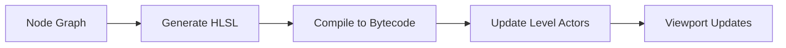

# The Toolbar: Workflow Execution and Compilation

Located immediately below the Menu Bar, the Toolbar contains high-frequency actions for asset management, graph organization, and the critical **compilation process**.

---

## Asset Operations

| Icon | Button | Function | Shortcut |
|------|--------|----------|----------|
| 💾 | **Save** | Write asset to disk | `Ctrl+S` |
| 🔍📁 | **Browse** | Navigate Content Browser to this asset | `Ctrl+B` |

---

## Compilation and Application

| Icon | Button | Function | Shortcut |
|------|--------|----------|----------|
| ✓ | **Apply** | Compile shader and update level | `Enter` |
| 🔍 | **Search** | Find nodes in graph | `Ctrl+F` |

> [!IMPORTANT]
> **Apply** is the most significant button. It triggers the shader compiler, generates HLSL, compiles to bytecode, and updates all actors using this material in the loaded level.

### Compilation Pipeline

---

## Graph Navigation and Organization

| Icon | Button | Function |
|------|--------|----------|
| 🏠 | **Home** | Recenter view on Main Material Node, reset zoom |
| 📊 | **Hierarchy** | Display material inheritance tree |
| 🧹 | **Clean Graph** | Delete unconnected nodes |
| 👁️ | **Hide Unrelated** | Fade nodes not connected to selection |

### Clean Graph

Identifies and removes all nodes not connected (directly or indirectly) to the Main Material Node.

> [!TIP]
> While the compiler strips dead code automatically, removing visual clutter improves readability and reduces file size.

### Hide Unrelated

When enabled, fades out all nodes not connected to the currently selected node. Essential for tracing specific data paths (e.g., isolating just the Roughness logic).

---

## Visualization and Statistics

| Button | Function |
|--------|----------|
| **Live Update** | Dropdown for real-time feedback options |
| **Stats** | Toggle Stats Panel visibility |
| **Platform Stats** | Multi-platform profiling window |

### Live Update Options

| Option | Effect |
|--------|--------|
| **Realtime Nodes** | Toggle preview thumbnails inside nodes |
| **Realtime Viewport** | Toggle continuous 3D preview rendering |

> [!TIP]
> Disable Realtime Nodes on lower-end hardware or with massive graphs to improve editor performance.

### Platform Stats

Unlike the standard Stats panel (generic instruction counts), Platform Stats shows metrics for **multiple platforms simultaneously**:

- PC D3D SM5
- Android Vulkan
- iOS Metal
- Console-specific targets

> [!IMPORTANT]
> Essential for multi-platform development to ensure materials designed for high-end hardware don't break mobile budgets.

---

## Toolbar Quick Reference

| Icon | Function | Shortcut |
|------|----------|----------|
| 💾 | Save | `Ctrl+S` |
| 📁🔍 | Browse to Content Browser | `Ctrl+B` |
| ✓ | Apply (Compile) | `Enter` |
| 🔍 | Search graph | `Ctrl+F` |
| 🏠 | Home (focus main node) | `H` |
| 📊 | Hierarchy | — |
| 🧹 | Clean Graph | — |
| 👁️ | Hide Unrelated | — |
| 📈 | Stats | — |
| 📱💻 | Platform Stats | — |

---

## Next Steps

Continue to [The Viewport Panel](./04-viewport-panel.md) to learn about visual validation and previewing.
