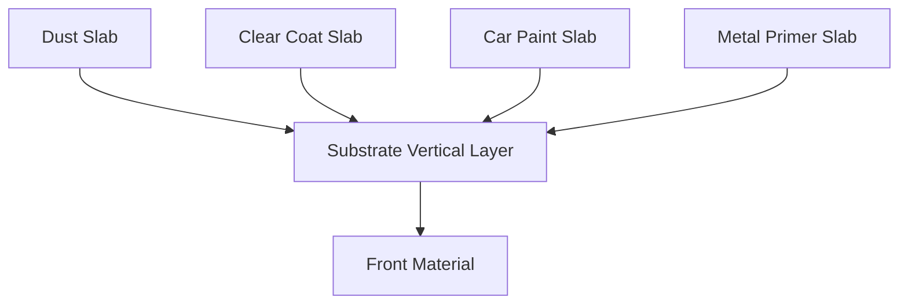

# The Substrate Framework (Experimental)

UE5 introduced **Substrate** (formerly Strata), a new material framework designed to replace the legacy "Uber Shader" model. It represents the future of the Material Editor interface.

> [!WARNING]
> Substrate is currently experimental. Enabling it converts your material irreversibly—there is no way to convert back to legacy mode.

---

## Key Interface Changes

### No Fixed Shading Model

The **Shading Model** dropdown in the Details Panel is removed entirely when using Substrate.

### Slab-Based Architecture

Instead of selecting a shading model, users construct materials using **Substrate Slab BSDF** nodes:

- Each Slab represents a layer of matter
- Slabs have Diffuse, Specular, and Roughness properties
- Complex materials are built by stacking slabs

### Simplified Main Node

The Main Material Node is reduced to a **single input**: `Front Material`.

---

## Slab Nodes

| Node | Purpose |
|------|---------|
| **Substrate Slab BSDF** | Define a single layer of matter |
| **Substrate Vertical Layer** | Stack slabs on top of each other |
| **Substrate Horizontal Blend** | Blend slabs side-by-side |
| **Substrate Unlit BSDF** | Emissive-only slab |
| **Substrate Metalness Helper** | Convert metalness to diffuse/F0 |

---

## Vertical Layering

The power of Substrate is in **physically-accurate layering** that was impossible in the legacy system:

### Example: Car Paint

| Layer | Material |
|-------|----------|
| 1 (Bottom) | Metal Primer |
| 2 | Base Color Paint |
| 3 | Clear Coat |
| 4 (Top) | Dust/Fingerprints |

---

## Legacy vs Substrate Comparison

| Aspect | Legacy | Substrate |
|--------|--------|-----------|
| Shading Model | Dropdown selection | Slab composition |
| Layering | Limited (Clear Coat only) | Unlimited |
| Physical Accuracy | Approximated | True multi-layer |
| Main Node Inputs | 15+ pins | 1 pin (Front Material) |
| Performance | Fixed cost | Dynamic based on complexity |

---

## Migration Considerations

### One-Way Conversion

Enabling Substrate on a material is irreversible. The editor will warn you before conversion.

### Authoring Mindset Shift

| Legacy Thinking | Substrate Thinking |
|-----------------|-------------------|
| "Select Clear Coat model" | "Layer Clear Coat Slab on top" |
| "Combine in shader" | "Build with physical layers" |
| "Fixed input slots" | "Compose slabs freely" |

---

## Additional Resources

For in-depth Substrate documentation, see the extended guides:

- [Substrate Overview](../substrate/01-overview.md)
- [Slab Architecture](../substrate/02-slab-architecture.md)
- [Graph Topology](../substrate/03-graph-topology.md)
- [G-Buffer and Closures](../substrate/04-gbuffer-closures.md)
- [Production Workflows](../substrate/05-production-workflows.md)
- [Advanced Features](../substrate/06-advanced-features.md)
- [Quick Reference](../substrate/07-quick-reference.md)

---

## Next Steps

Continue to [Quick Reference](./11-quick-reference.md) for toolbar and PBR input tables.
