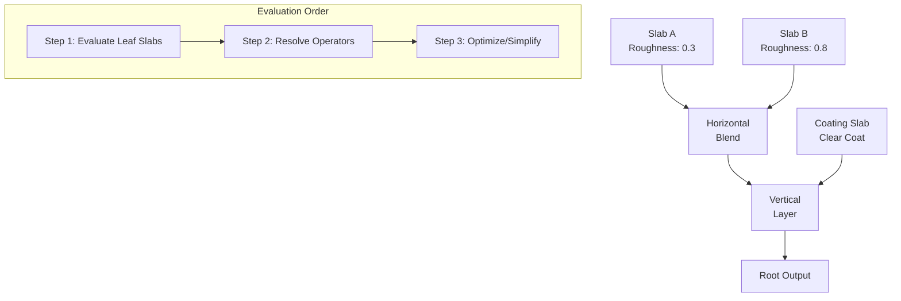

# Substrate Graph Topology

> Substrate's power lies in how Slabs are **combined**. The framework provides two fundamental operators: **Vertical Layering** (stacking matter) and **Horizontal Mixing** (blending matter).

---

## Vertical Layering: The Physics of Coating

The **Substrate Vertical Layer** operator places one Slab on top of another, simulating a physical coating. This is a profound departure from legacy "Material Layers," which merely blended texture attributes (A + B) before shading.

### How Vertical Layering Works

```
        ┌─── Incoming Light ───┐
        │                      │
        ▼                      │
┌───────────────────────┐      │
│      TOP SLAB         │ ◄──  │ 1. Light strikes Top Interface
│   (e.g., Clear Coat)  │      │    → Specular reflection calculated
│                       │      │
│   Roughness: 0.02     │ ────►│ 2. Remaining light transmitted
│   F0: 0.04            │      │    through Top Medium
└───────────────────────┘      │
         │                     │
         ▼ (attenuated)        │
┌───────────────────────┐      │
│     BOTTOM SLAB       │ ◄────┘ 3. Transmitted light hits Bottom
│   (e.g., Car Paint)   │        → Reflection/scattering
│                       │
│   Roughness: 0.4      │ ─────► 4. Result travels back UP
│   F0: [0.9, 0.6, 0.3] │        through Top Medium
└───────────────────────┘        (attenuates again) → exits
```

### Key Capabilities

| Feature | Legacy Clear Coat | Substrate Vertical Layer |
|---------|-------------------|--------------------------|
| Materials that can be layered | Only predefined pairs | **Any two Slabs** |
| Independent roughness | Limited | ✓ Full independence |
| Colored coatings | Very limited | ✓ Full color control |
| Multiple layers | Not supported | ✓ Stack as many as budget allows |

### Example: Wet Concrete

```javascript
// Top Layer: Water Film
topSlab = {
  Roughness: 0.0,           // Perfectly smooth
  F0: [0.02, 0.02, 0.02],   // Water's low reflectance
  Transmittance: [1, 1, 1]  // Clear
}

// Bottom Layer: Rough Concrete
bottomSlab = {
  Roughness: 0.8,           // Very rough
  DiffuseAlbedo: [0.3, 0.3, 0.3],
  F0: [0.04, 0.04, 0.04]
}

// Result: Sharp water reflection + blurry concrete underneath
verticalLayer(topSlab, bottomSlab, thickness: 0.5)
```

### Independent Roughness Effects

When you vertically layer materials:

1. **Sharp reflection** from smooth water surface (Roughness 0.0)
2. **Blurry reflection** from rough concrete (Roughness 0.8)
3. Both specular lobes exist in the same pixel

The engine tracks two separate specular calculations—something impossible in legacy Clear Coat.

### Colored Coatings

A yellow-tinted varnish over blue metal:

```javascript
// Yellow varnish
topSlab = {
  Transmittance: [1.0, 0.9, 0.5],  // Yellow tint (absorbs blue)
  Thickness: 2.0
}

// Blue metal
bottomSlab = {
  F0: [0.2, 0.4, 0.8]  // Blue-ish metal
}
```

Light is filtered by the varnish **twice** (on entry and exit), accurately shifting the perceived metal color.

---

## Horizontal Blending: Spatial Partitioning

The **Substrate Horizontal Blend** operator mixes two Slabs side-by-side, partitioning the pixel's surface area.

### How Horizontal Blending Works

```
┌──────────────────────────────────┐
│                                  │
│    ████████████░░░░░░░░░░░░░░    │
│    ████████████░░░░░░░░░░░░░░    │
│    SLAB A      │      SLAB B     │
│    (70%)       │      (30%)      │
│                                  │
└──────────────────────────────────┘
               Mix = 0.3
```

### Inputs

| Pin | Type | Description |
|-----|------|-------------|
| Background | Substrate | First material (shown when Mix = 0) |
| Foreground | Substrate | Second material (shown when Mix = 1) |
| Mix | Float | Blend weight (0.0 to 1.0) |

### Key Difference from Legacy

Legacy "Material Layer Blend" interpolated **texture attributes** before shading:

```
// Legacy approach (pre-shading blend)
blendedRoughness = lerp(roughnessA, roughnessB, mix)
// Then shade once with blended values
```

Substrate Horizontal Blend operates on **full BSDF closures**:

```
// Substrate approach (post-shading blend)
closureA = evaluateSlab(slabA)  // Full lighting calculation
closureB = evaluateSlab(slabB)  // Full lighting calculation
result = mix(closureA, closureB, mixWeight)
```

This means you can horizontally mix:

- Subsurface Scattering Slab (skin) with Standard Lit Slab (metal implant)
- Cloth Slab (fabric) with Metallic Slab (buttons)

---

## Graph Evaluation Order

When the shader compiles, the engine traverses the graph **bottom-up** (from Root Node backwards):



### Step 1: Evaluate Leaf Slabs

Compute Albedo, F0, Roughness for each terminal Slab node.

### Step 2: Resolve Operators

- If a Horizontal Blend is encountered with mix = 0.5, interpolate the closures
- If a Vertical Layer is encountered, compute recursive light bounces

### Step 3: Optimize

If complexity exceeds the platform budget, the engine may perform **Parameter Blending**:

```javascript
// If too expensive, simplify by averaging:
simplifiedRoughness = (slabA.roughness + slabB.roughness) / 2
// Instead of evaluating two separate lighting calculations
```

---

## Composition Patterns

### Pattern 1: Multi-Layer Car Paint

```
Carbon Fiber Base
    └── Vertical Layer ← Metallic Flake Layer
            └── Vertical Layer ← Clear Coat
```

### Pattern 2: Cybernetic Skin

```
Horizontal Blend (mask from texture)
    ├── Background: Subsurface Skin Slab
    └── Foreground: Metallic Implant Slab
```

### Pattern 3: Weathered Surface

```
Vertical Layer
    ├── Top: Dust/Dirt Slab (partial coverage)
    └── Bottom: Horizontal Blend
            ├── Oxidized Metal Slab
            └── Clean Metal Slab (rust pattern mask)
```

---

## Input Order Matters

> ⚠️ **Warning:** The Vertical Layer node has strictly defined inputs: **Top** and **Bottom**.

| Input | Purpose |
|-------|---------|
| Top | The coating (closer to viewer) |
| Bottom | The substrate (underneath) |
| Thickness | Controls optical depth (drives Beer-Lambert absorption) |

Unlike a simple "Alpha Lerp," Thickness is not just a blend weight—it controls how much light is absorbed traveling through the top layer.

---

## Performance Considerations

| Operation | Closure Cost | Notes |
|-----------|--------------|-------|
| Single Slab | 1-2 closures | Diffuse + Specular |
| Horizontal Blend (2 Slabs) | 2-4 closures | Each Slab evaluated separately |
| Vertical Layer (2 Slabs) | 2-4 closures | Recursive bounce calculation |
| Complex Car Paint | 4+ closures | Base + Flakes + Clear Coat |

Each closure consumes G-Buffer memory. See [G-Buffer and Closures](./04-gbuffer-closures.md) for memory management.

---

## Next: G-Buffer Architecture

Learn how Substrate manages memory with [adaptive G-Buffer strategies](./04-gbuffer-closures.md).
