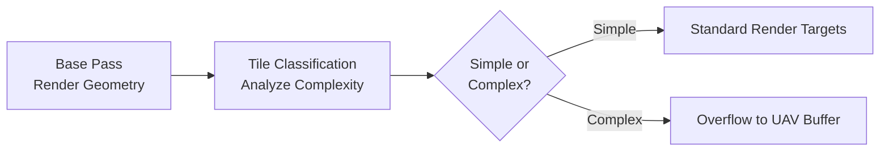

# G-Buffer and Closure Architecture

> Substrate's most significant engineering challenge is **managing G-Buffer memory**. Storing arbitrary layers of materials requires a dynamic approach, unlike the fixed-layout legacy G-Buffer.

---

## The Concept of Closures

In Substrate, a material is compiled at runtime into a stream of **Closures**. A Closure is a data structure representing a single element of light interaction:

| Closure Type | Description |
|--------------|-------------|
| Specular Lobe | Reflection from a surface interface |
| Diffuse Lobe | Scattered light from within the material |
| Transmittance Event | Light passing through transparent medium |

### Closure Count Examples

| Material | Closure Count | Notes |
|----------|---------------|-------|
| Simple plastic | 2 | Diffuse + Specular |
| Metallic surface | 1-2 | Specular only (no diffuse) |
| Clear coat paint | 3-4 | Base + Coat specular lobes |
| Complex car paint | 4+ | Base + Flakes + Clear Coat |

### Data Packing

The engine aggressively packs closures into a stream of **unsigned integers (UINTs)** using:

- **Quantization:** Compressing floats to smaller integers
- **Dithering:** Adding noise to mask compression artifacts

---

## G-Buffer Format Options

Substrate introduces a **bifurcated G-Buffer strategy** to balance fidelity and performance. Controlled via:

- **Project Settings:** Engine > Rendering > Substrate
- **Console Variable:** `r.Substrate.BlendableGBuffer`

### Option 1: Blendable G-Buffer (Performance-First)

| Property | Value |
|----------|-------|
| Target Audience | 60fps+ games, competitive multiplayer, mobile |
| Philosophy | **Predictability** — fixed memory footprint per pixel |
| CVar Setting | `r.Substrate.BlendableGBuffer=1` (default for new projects) |

#### How It Works

If a material graph generates **more closures than the fixed budget allows**, the engine performs **Parameter Blending**:

```javascript
// Original: Clear Coat over Base (2 specular lobes)
// Simplified: Single averaged slab
averagedRoughness = (baseRoughness + coatRoughness) / 2
averagedF0 = (baseF0 + coatF0) / 2
// Result: Single specular lobe with averaged properties
```

| Pros | Cons |
|------|------|
| ✓ Performance parity with legacy UE5 | ✗ Complex layering effects approximated or lost |
| ✓ No unexpected performance spikes | ✗ Visual fidelity capped |
| ✓ Works on all platforms | |

### Option 2: Adaptive G-Buffer (Quality-First)

| Property | Value |
|----------|-------|
| Target Audience | Cinematics, automotive visualization, hero assets |
| Philosophy | **Accuracy** — dynamic G-Buffer allocation |
| CVar Setting | `r.Substrate.BlendableGBuffer=0` |
| Platform Requirement | **SM6 only** (DX12, PS5, Xbox Series X) |

#### How It Works



1. **Base Pass:** Geometry is rendered normally
2. **Tile Classification:** Engine analyzes screen in tiles, classifying pixels by complexity
3. **Data Storage:**
   - Simple pixels → Standard Render Targets
   - Complex pixels → Excess data spills to **UAV** (Unordered Access View)

| Pros | Cons |
|------|------|
| ✓ Deep layering (Water over Oil over Paint over Metal) | ✗ Variable performance cost |
| ✓ Full material fidelity | ✗ ~15% longer shader cooking time |
| ✓ Accurate multi-layer reflections | ✗ SM6 platforms only |

---

## Data Budget and Overflow

The system operates under a **strict data budget** controlled by:

```
r.Substrate.BytesPerPixel = 80  (default)
```

### What Happens at Overflow

If a pixel's material graph generates more closures than `BytesPerPixel` allows, even in Adaptive mode:

| Symptom | Visual Artifact |
|---------|-----------------|
| Data cannot be stored | **Magenta/Black Checkerboards** |
| Stripped closure data | Incorrect lighting, missing layers |

### Remediation Strategies

| Solution | Trade-off |
|----------|-----------|
| Increase `r.Substrate.BytesPerPixel` to 96 or 128 | Higher VRAM bandwidth consumption |
| Simplify material graph | Reduced visual fidelity |
| Use LOD materials | Distance-based complexity reduction |

> ⚠️ **Important:** Increasing BytesPerPixel affects **every pixel on screen**, not just complex materials.

---

## Closure Visualization

Substrate introduces new **View Modes** for profiling:

### Closure Count View

```
Console: ShowFlag.VisualizeSubstrateClosureCount 1
```

Displays a heat map showing closures per pixel:

| Color | Closure Count | Performance Impact |
|-------|---------------|-------------------|
| Blue/Green | 1-2 | Minimal |
| Yellow | 3-4 | Moderate |
| Orange/Red | 5+ | High (review material) |

### Material Complexity View

Updated to reflect Substrate graph evaluation cost, not just instruction count.

### G-Buffer Visualization

Shows raw data stored per pixel. In Adaptive mode, visualizes where UAV overflow is occurring.

---

## Platform Comparison

| Feature | Legacy UE5 | Substrate Blendable | Substrate Adaptive |
|---------|------------|---------------------|-------------------|
| G-Buffer Size | Fixed | Fixed | Dynamic |
| Multi-layer coating | Shading model hack | Parameter blending | Full evaluation |
| Performance | Predictable | Predictable | Variable |
| Platform Support | All | All | SM6 only |
| Closure Limit | N/A | Fixed | Soft (UAV overflow) |

---

## Console Variable Reference

| CVar | Default | Description |
|------|---------|-------------|
| `r.Substrate` | 1 | Enable/disable Substrate system |
| `r.Substrate.BytesPerPixel` | 80 | G-Buffer memory budget per pixel |
| `r.Substrate.BlendableGBuffer` | 1 | Force Blendable mode (0 = Adaptive) |
| `r.Substrate.Debug.ClosureCount` | 0 | Show closure count overlay |

---

## Best Practices

### For Real-Time Games (60fps target)

1. Use **Blendable G-Buffer** mode
2. Keep hero materials under 3-4 closures
3. Use LOD materials to reduce complexity at distance
4. Profile with Closure Count view before shipping

### For Cinematics/Visualization

1. Use **Adaptive G-Buffer** mode
2. Increase `BytesPerPixel` if seeing overflow artifacts
3. Accept variable frame times for quality
4. Test on target hardware (PS5/XSX/high-end PC)

---

## Next: Production Workflows

Learn migration strategies and authoring workflows in [Production Workflows](./05-production-workflows.md).
